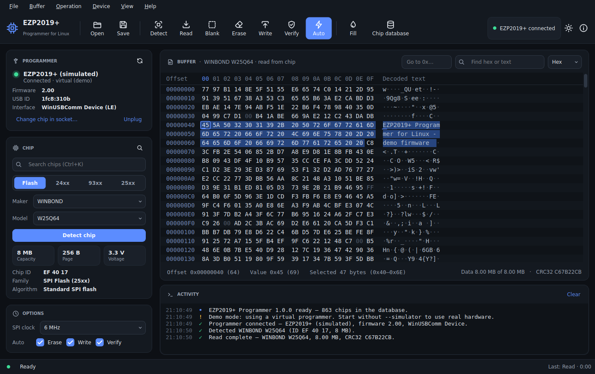
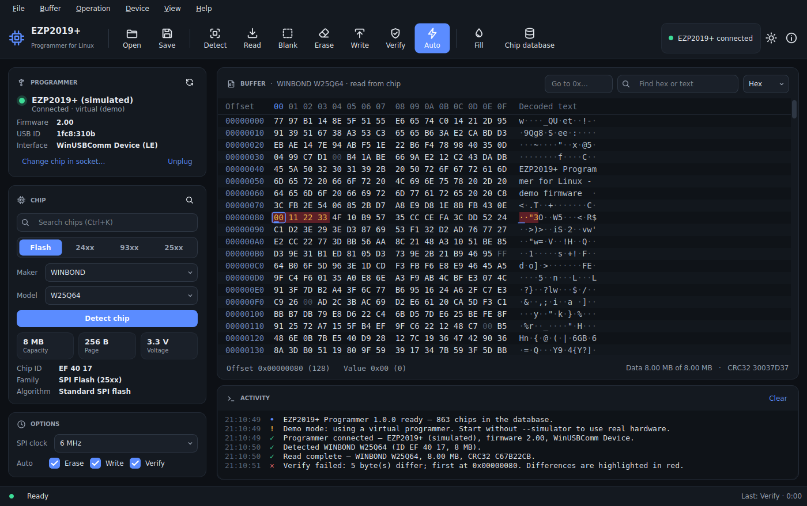
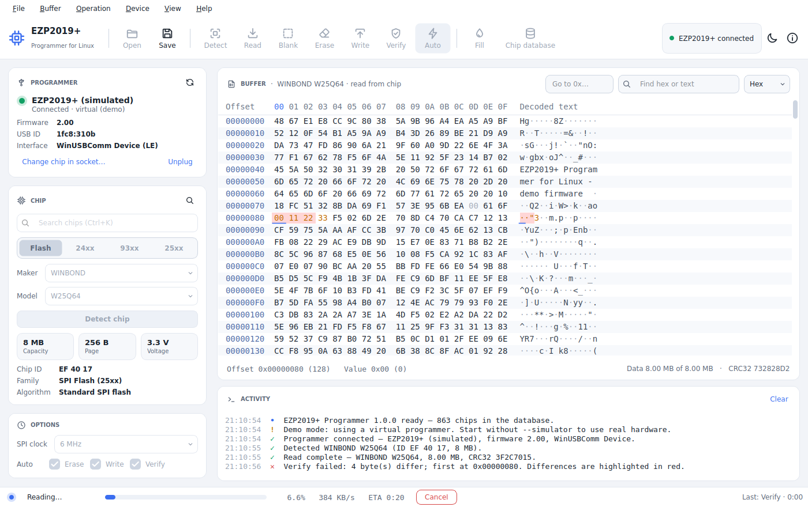
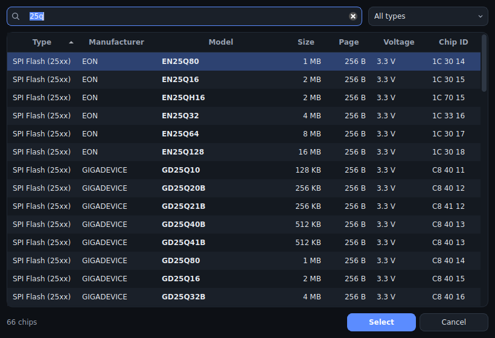
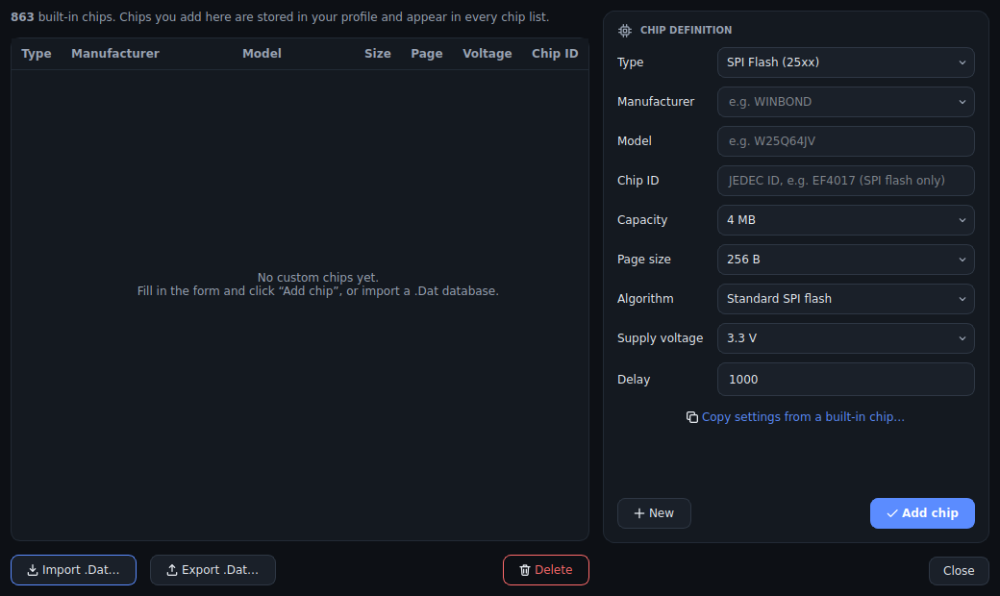

# EZP2019+ Programmer for Linux

A modern, open-source replacement for the Windows software of the **EZP2019 /
EZP2019+ USB programmer**, made for Arch Linux (it runs on any Linux with
Python, Qt 6 and libusb). It reads, writes, erases, verifies and blank-checks
25-series SPI flash and 24/25/93-series EEPROMs, identifies the chip in the
socket, and adds a proper hex editor, dark and light themes and a
command-line interface.



## Features

Everything the vendor's Windows tool (EZP2019+ v2.0) does:

- **Detect**: reads the JEDEC ID of SPI flash and selects the matching chip
  from the 863-chip database. When several chips share an ID, you pick the
  exact part. For 24xx and 93xx EEPROMs the programmer reports the family.
- **Read, Erase, Write, Verify, Blank check and Auto** (erase → write →
  verify in one go, with each step switchable), using the same USB command
  sequences as the vendor software.
- **Programmer status**: hot-plug detection, firmware version, USB interface
  variant, and a clear message with a one-click fix when USB permissions are
  missing.
- **SPI clock** selection from 12 MHz down to 375 kHz.
- **Chips**: SPI flash (including SST parts, chips over 16 MB that need
  4-byte addressing, and 1.8 V parts through the 1.8 V adapter), 24xx I²C,
  93xx Microwire (8- and 16-bit organisation) and 25xx SPI EEPROMs.
- **Buffer editing**: hex editor with overwrite editing, selection, copy and
  paste, find (hex or text), go to address, and fill with a byte, a 16-bit word
  or random data.
- **Files**: `.bin`/`.rom`, Intel HEX, Motorola S-record, ASUS `.cap` BIOS
  capsules (2 KB header stripped) and `.eep` (HEX, S-record or binary).
- **Chip database editor**: add your own chip definitions, and import or
  export the Windows `EZP2019+.Dat` format.

Improvements over the Windows version:

- Dark and light themes that follow the desktop setting.
- Background operations with progress, speed, time remaining and **Cancel**.
- Verify reports every differing byte and highlights them in the hex view,
  instead of stopping at the first one.
- Searchable chip picker (by model, maker or JEDEC ID) and an activity log.
- Drag and drop, recent files, and remembered settings.
- A scriptable command-line interface.
- A demo mode with a virtual programmer, so you can try the app without
  hardware.

| Verify errors highlighted | Operation in progress (light theme) |
|---|---|
|  |  |

| Chip search | Chip database editor |
|---|---|
|  |  |

## Install on Arch Linux

Run these as your normal user (not root); `makepkg` asks for your password
when it installs the package:

```sh
sudo pacman -S --needed base-devel git
git clone https://github.com/oreo1298/EZP2019Linux.git
cd EZP2019Linux
makepkg -si
```

This installs the `ezp2019linux` command, the **EZP2019+ Programmer** desktop
entry and a udev rule that gives your user access to the programmer. If the
programmer was plugged in during installation, unplug it and plug it back in
once.

Dependencies (pulled in automatically): `python`, `pyside6`, `qt6-svg`,
`qt6-wayland`, `python-pyusb` and `libusb`.

To update later, pull the new code and build again from the same folder:

```sh
cd EZP2019Linux
git pull
makepkg -si
```

If `makepkg` says `PKGBUILD does not exist`, you are not inside the
`EZP2019Linux` folder.

### Other distributions, or without a package

```sh
python -m venv ~/.local/share/ezp2019linux
~/.local/share/ezp2019linux/bin/pip install .
~/.local/share/ezp2019linux/bin/ezp2019linux install-udev
~/.local/share/ezp2019linux/bin/ezp2019linux
```

libusb 1.0 must be installed (it is on almost every distribution).

### USB permissions

Without a udev rule only root can open the programmer, and the app shows
"No permission to open the device" with a **Fix USB permissions** button.
The Arch package installs the rule for you. Otherwise run
`ezp2019linux install-udev`, or do it by hand:

```sh
sudo cp packaging/udev/70-ezp2019linux.rules /etc/udev/rules.d/
sudo udevadm control --reload-rules && sudo udevadm trigger
```

The rule grants access to the user logged in at the local seat (`uaccess`).
On a headless machine, change `MODE="0660"` to `MODE="0666"` in the rule.

## Using the app

1. Plug in the programmer. The toolbar shows **EZP2019+ connected**.
2. Put the chip in the socket (pin 1 towards the lever) or attach the clip.
3. Click **Detect chip**. SPI flash is identified automatically. For EEPROMs
   pick the family (24xx, 93xx, 25xx), maker and model, or type a part number
   into the search box (<kbd>Ctrl</kbd>+<kbd>K</kbd>).
4. **Read** the chip and **Save** the buffer to keep a backup.
5. To program: **Open** a file (or edit the buffer), then click **Auto** to
   erase, write and verify. The steps Auto runs are set under **Options**.

SPI flash must be erased before writing (Auto does this for you); EEPROMs do
not. Write sends the data part of the buffer; for SPI flash trailing `0xFF`
bytes are skipped because an erased chip already contains them.

| Action | Shortcut |
|---|---|
| Open / Save | <kbd>Ctrl</kbd>+<kbd>O</kbd> / <kbd>Ctrl</kbd>+<kbd>S</kbd> |
| Detect | <kbd>Ctrl</kbd>+<kbd>D</kbd> |
| Read | <kbd>F5</kbd> |
| Blank check | <kbd>F4</kbd> |
| Erase | <kbd>F6</kbd> |
| Write | <kbd>F7</kbd> |
| Verify | <kbd>F8</kbd> |
| Auto | <kbd>F9</kbd> |
| Cancel the running operation | <kbd>Esc</kbd> |
| Find chip | <kbd>Ctrl</kbd>+<kbd>K</kbd> |
| Find in buffer / next / previous | <kbd>Ctrl</kbd>+<kbd>F</kbd> / <kbd>F3</kbd> / <kbd>Shift</kbd>+<kbd>F3</kbd> |
| Go to address | <kbd>Ctrl</kbd>+<kbd>G</kbd> |
| Fill | <kbd>Ctrl</kbd>+<kbd>L</kbd> |
| Toggle dark/light theme | <kbd>Ctrl</kbd>+<kbd>Shift</kbd>+<kbd>T</kbd> |

In the hex view, type hex digits to overwrite bytes, press <kbd>Tab</kbd> to
switch between the hex and text columns, and right-click for copy, paste and
fill.

## Command line

Running `ezp2019linux` with no arguments opens the GUI. Every operation is
also available as a sub-command:

```sh
ezp2019linux list                           # connected programmers
ezp2019linux info                           # firmware, USB interface variant
ezp2019linux detect                         # identify the chip in the socket
ezp2019linux chips 25q64                    # search the chip database

ezp2019linux read backup.bin                # auto-detects SPI flash
ezp2019linux read -c 24C02 eeprom.hex       # EEPROMs need --chip
ezp2019linux auto -c W25Q64 firmware.bin    # erase, write and verify
ezp2019linux write -c 93C66 -v dump.bin     # write, then verify
ezp2019linux verify -c WINBOND:W25Q64 firmware.bin
ezp2019linux erase -c W25Q64 -y
ezp2019linux blank -c W25Q64
```

Useful options: `-s 3MHz` sets the SPI clock, `--no-check` skips the chip
presence check, and `--debug` prints every USB packet. Chip names accept
`NAME`, `MAKER:NAME` or `TYPE:MAKER:NAME`. The output format of `read` follows
the file extension (`.bin`, `.hex`, `.srec`).

Try it without hardware using the virtual programmer:

```sh
ezp2019linux --simulator                          # GUI in demo mode
ezp2019linux --simulator --sim-chip 24C02 detect
```

## Supported chips

The bundled list comes from the vendor database: 319 SPI flash, 193 24xx,
217 93xx and 134 25xx EEPROM definitions from AMIC, Atmel, EON, GigaDevice,
Macronix, Micron, Microchip, Spansion, SST, ST, Winbond and many more. Use
`ezp2019linux chips` or the chip search to browse them. Missing a chip? Add
it under **Chip database**, or pick a compatible model with the same size and
page size.

## Troubleshooting

- **"Not connected"**: check that `lsusb` lists `1fc8:310b`. Try another cable
  or port; front-panel hubs are often unreliable.
- **"No permission to open the device"**: install the udev rule (see above),
  then replug the programmer.
- **"No chip detected"**: check the chip orientation and the clip contacts.
  The check can be turned off under **Device → Check for a chip before
  operations** (the programmer cannot see 25xx EEPROMs, so the check is
  always skipped for them).
- **Unknown chip ID**: select a model with the same capacity and page size.
- **Unstable reads or verify errors**: lower the SPI clock, keep wires short,
  make sure SPI flash was erased before writing, and for 93xx EEPROMs choose
  the entry with the right organisation (×8 or ×16).
- **Reporting a problem**: enable **Device → Log USB traffic** (or run the CLI
  with `--debug`) and include the log.

## How it works

The EZP2019+ protocol is not documented. It was recovered from the vendor's
`EZP2019+.exe` v2.0 by disassembling its USB class and operation handlers, and
is described in [docs/PROTOCOL.md](docs/PROTOCOL.md). Two firmware variants
exist; they use different endpoints and byte orders, and both are supported.
The command sequences (including timings such as the 50 ms response delay and
the settle times for 24xx EEPROMs and Auto) match the vendor software.

The code is split into:

| Path | Contents |
|---|---|
| `ezp2019linux/core/protocol.py` | Packet layouts and constants |
| `ezp2019linux/core/transport.py` | libusb transport (pyusb) |
| `ezp2019linux/core/programmer.py` | Operations and their USB sequences |
| `ezp2019linux/core/chipdb.py` | Chip database, `.Dat` import and export |
| `ezp2019linux/core/fileio.py` | Image file formats |
| `ezp2019linux/core/simulator.py` | Virtual programmer used for tests and demo mode |
| `ezp2019linux/gui/` | PySide6 interface |
| `ezp2019linux/cli.py` | Command-line interface |

### Hardware testing status

Every operation is tested end to end against the packet-level simulator for
all four chip families and both firmware variants, and the libusb transport
is tested against a fake device. It has not yet been run against a physical
EZP2019+ by the author. If something does not work with your programmer,
please open an issue with a `--debug` log.

## Development

```sh
python -m venv .venv && . .venv/bin/activate
pip install -e '.[test]'
pytest                                  # 70+ tests; the GUI tests run offscreen
ezp2019linux --simulator                # demo mode
python tools/screenshot.py /tmp/shots   # regenerate screenshots
python tools/dat2json.py EZP2019+.Dat   # refresh the chip list from a vendor database
```

## Credits and license

MIT licensed, see [LICENSE](LICENSE). The chip list was converted from the
database that ships with the vendor's EZP2019+ software. Thanks to
[bokic/ezp2019](https://github.com/bokic/ezp2019) and
[themactep/scriba](https://github.com/themactep/scriba) for earlier work on
the protocol. This project is not affiliated with the hardware vendor.
